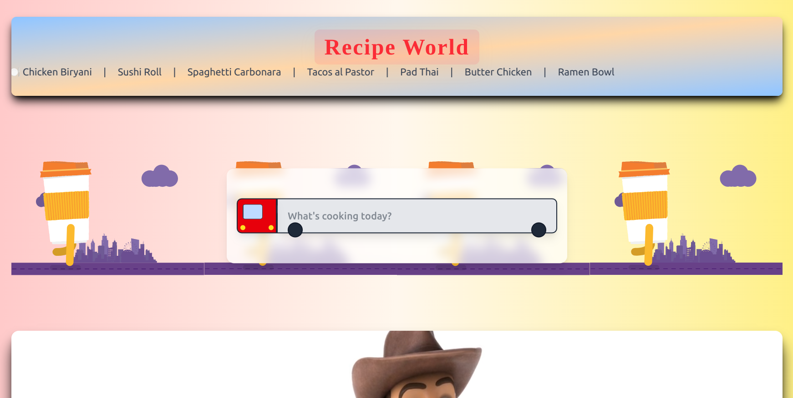

# Recipe-world
Recipe world is a sleek and responsive recipe search application built with *React*. It allows users to search for meals using TheMealDB API, view detailed recipe instructions, and explore curated food content with a user-friendly interface.

## 🚀 Features

- 🔍 *Live Search* with debounce functionality
- 📱 *Responsive Design* optimized for all screen sizes
- 🎬 *Animated Splash Screen*
- 🧾 *Detailed Recipe View* with ingredients and instructions
- 💡 Built using *React, **Tailwind CSS, and **custom CSS*

## 🖼️ Screenshots

### HomePage

### Potrait UI

Frontend:* React, CSS
- *API:* [TheMealDB API](https://www.themealdb.com/api.php)
- *Routing:* React Router

- ## 📦 Getting Started

### 1. Clone the repo
bash
git clone https://github.com/your-username/recipe-hub.git
cd recipe-hub

### 2. Install dependencies

npm install

### 3. Start the develpoment 

npm run dev

## 🌐 Live Demo 

https://youtu.be/K92LXLDjxL0
